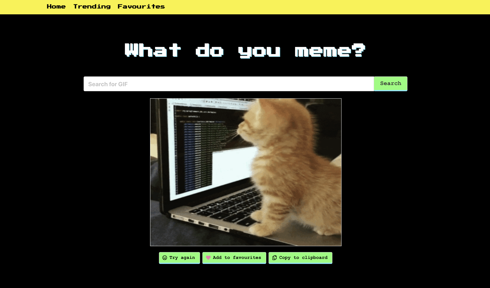

# Project two: What do you meme?

## Overview

GIFs, memes and emojis have become an integral part of pop culture. They often provide a means of conveying a feeling or reaction that can't be put into words. For the second project on the course, I worked with a partner to pair programme a GIF generator using the GIPHY API endpoints during a 48-hour hackathon. 

We were allowed to work with any third-party API for the project. We selected GIPHY as it had solid documentation and support for developers, so we knew it would be reliable and easy to use given the time contstraints of the assignment. GIPHY has a number of search endpoints from providing a random GIF from its database to its 'special sauce' algorithm that magically seems to produce the perfect result.

We wanted users to be able to search for GIFs based on key search words, to save GIFs to their ‘Favourites’ page and to copy to GIFs to their clipboard to share on other applications.

The final result can be found at: https://what-do-you-meme.netlify.app/.

To install and run this app, make sure you have Yarn and run  `yarn install` to get started!

## Table of contents

* [Brief](#Brief)
* [Final product](#Final-product)
* [Wins and challenges](#Wins-and-challenges)
* [Bugs](#Bugs)

## Brief

### Technical requirements

* **Build a React application** that **consumes a public API**
* **Have several components** - at least one classical and one functional
* **The app can have a router** with several 'pages'
* **Include wireframes** that are designed before building the app
* **Be deployed online** and accessible to the public.

### Languages and technologies used

* React JS
* SASS
* Babel
* Webpack
* Yarn
* Node
* Axios
* JSON

## Final product

### App

Considering that we had just under two days to complete the app, we were highly focused in what we wanted to produce:

* Take advantage of the GIPHY API, specifically its 'special sauce' algorithm on the landing page of the application 
* Allow users to search for single GIF through the search input on the main page
* If users were not happy with the search result, they could try again
* Users could add results to their 'Favourites' page
* 'Favourites' page utilised local storage, so users would be able to store GIFs for use on subsequent visits as well as offline
* Users could also add favourites via the 'Trending' page which compiled and displayed the top 25 GIFs being shared globally through GIPHY. This was updated every ten minutes or so via the GIPHY API
* User could copy GIFs to their clipboard in order to share on other platforms and apps

### Design

Design was split between my partner wireframing the website with input from me, while I wrote the most of the SCSS file with feedback from my partner. As we were pair coding the application, we were able to be consistent in our use of Bulma in creating the semantic structure of the components we used.

The overall design aethetic was inspired by the GIPHY logo which uses many neon colours - reminiscent of 80s video games, which also fed into the decision to use the monospace fonts.

## Wins and challenges

### Wins

The biggest win was being able to pair code the application. Compared to the first, solo project of the course, it was so enjoyable to be able to work with another student because it helped us to take on and balance a bit more workload along with having someone to bounce ideas off of and to deepen our understanding of React and working with APIs.

Another win was working with the GIPHY API. The documentation was so clear and helpful, which aided us in organising our various API requests and allowed us to get on to the actual coding of the application.

### Challenges 

A challenge for us was working with the Bulma CSS framework for the first time. It can be quite opinionated, and we came up against it on a couple matters. One that comes to mind is on the cards that displayed the GIFs on the 'Trending' and 'Favourites' pages. We wanted to create a bit more margin but even asking for 1px of space would throw off the layout of the pages completely. We ended up having to play by Bulma's rules in order to deliver the application on time. I'm sure, however, that if we were to revisit with more development time allowed, we would have been able to find a suitable workaround having had additional experience with Bulma.

### Bugs

There were a few bugs around styling which ulitmately were very minor and had to do with Bulma (see [Challenges](#Challenges) above).

### Future content

I was/still am very proud of what we were able to produce with the given brief. Future content would likely be to allow users to create, upload and submit their own GIFs to GIPHY through our application. I would also want to see if some of the design and layout could be improved either by walking back some of the Bulma implementaion or by working a bit more harmoniously with it.
